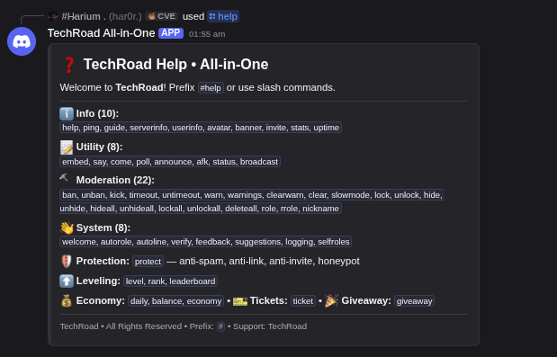
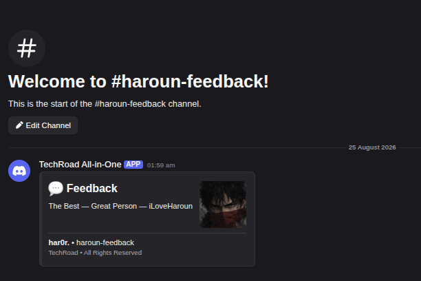
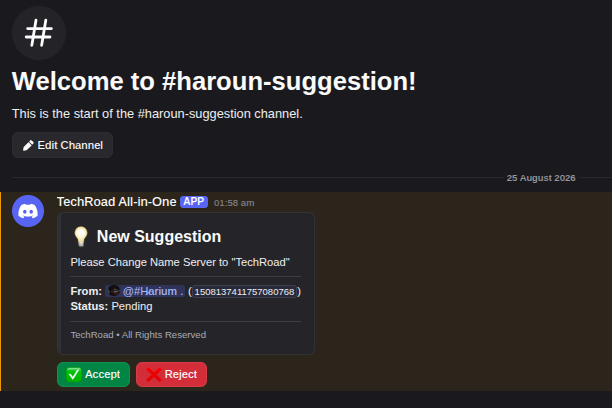
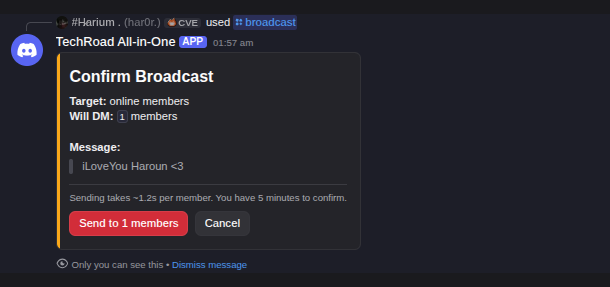
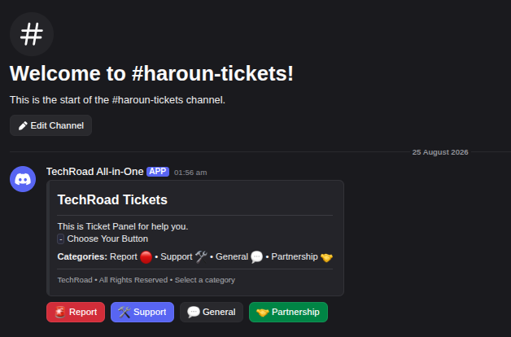
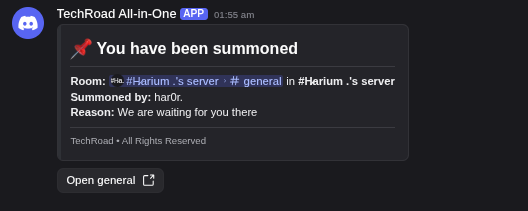
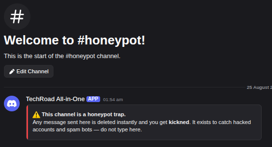

# TechRoad All-in-One

One bot for your whole Discord server — moderation, protection, leveling, tickets, broadcast, logging and more. Built with discord.js and stores everything in flat JSON files, so there is no database to install.

   

## Screenshots

| | |
|---|---|
|  |  |
|  |  |
|  |  |
| 

## Features

**Moderation** — ban, unban, kick, timeout, warn + warnings history, clear, slowmode, lock/unlock and hide/unhide single channels or whole categories, role management, nickname.

**Protection** (`/protect`) — anti-spam (messages per seconds window), anti-link, anti-invite, and a **honeypot** trap channel: anyone who posts anything in it gets banned or kicked instantly (owner picks the punishment). Built for hacked accounts that auto-post.

**Leveling** — members earn XP by chatting, `/rank` and `/leaderboard` to track it.

**Tickets** — `/ticket setup` opens a form, panel with 4 categories (Report / Support / General / Partnership), close + claim buttons.

**Broadcast** (`/broadcast`, admin) — DM everyone, only online members, or only offline members. Target picker, message form, confirm button, delivery report.

**Feedback & Suggestions** — set a channel and every message in it becomes a clean embed with the author's name and avatar (feedback) or a suggestion with accept/reject buttons. Posts under 6 characters are deleted automatically.

**Media channels** (`/autoline`) — turn any channel into images-and-videos only; everything else is deleted.

**Logging** — messages deleted/edited, members join/leave, roles, channels, voice movements. Logs use plain names, no member pings.

**Extras** — welcome card with canvas banner, autorole (humans/bots), verify button, selfroles panel, embed builder with form + buttons, giveaways, polls, AFK, `/come` DM summon with reason and room link, and an optional economy mode chosen when the bot joins the server.

## Setup

```bash
git clone <your-repo-url>
cd TechRoad-AllInOne
npm install
cp config.example.json src/config.json   # then edit it
node src/index.js
```

In the [Developer Portal](https://discord.com/developers/applications) enable these intents for your bot:

- **SERVER MEMBERS INTENT** (welcome, autorole, broadcast)
- **PRESENCE INTENT** (online/offline broadcast targets)

Invite the bot with `applications.commands` + `bot` scopes. Administrator permission is the simple route for self-hosting; the bot asks for what it needs per command anyway.

## Configuration

`src/config.json`

| Key | Description |
|---|---|
| `token` | Bot token — never commit the real one |
| `prefix` | Prefix for text commands (default `#`) |
| `guildId` | Your server id — commands sync there instantly on startup |
| `clientId` | Application id |
| `owner` / `owners` | User ids with owner access |
| `branding` | Bot name, embed color, footer text |
| `presence` | Status and activity shown under the bot |

## Storage

Everything lives in `database/` as one JSON file per key (`welcome.json`, `protect.json`, per-member level files, ...). Back up that folder and you backed up the bot.

## Notes

- Slash commands and `#prefix` commands both work everywhere.
- Economy is opt-in per server: when the bot joins, it asks whether the server wants coins (shop mode) or community mode. Toggle anytime with `/economy toggle`.
- `scripts/` contains self-test harnesses: `node scripts/smoke-test.js`, `node scripts/component-test.js`, `node scripts/event-test.js`.

## Credits

Made by **TechRoad Inc.** © 2026/2027 — All Rights Reserved.
